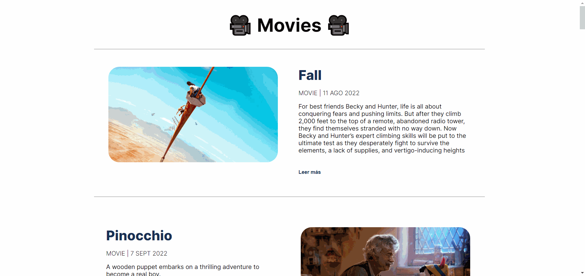

<h1 align='center'>Movies paaa 🎥</h1>

## 📜 Descripción 📜

  Movies paaa 🎥, es una aplicación web, para mostrar películas, con su información tales como sinopsis, puntuación, popularidad entre otros.

## 📸 Gif web 📸

  

## 👨‍💻 Tecnologías utilizadas 👨‍💻

  <table>
    <thead>
      <tr>
        <th align='center'>HTML</th>
        <th align='center'>Sass</th>
        <th align='center'>
          Vite
        </th>
        <th align='center'>
          Javascript
        </th>
        <th align='center'>
          React
        </th>
        <th align='center'>
          Luxon
        </th>
        <th align='center'>
          Dotenv
        </th>
      </tr>
    </thead>
    <tbody>
      <tr>
        <td>
          
        </td>
        <td>
          
        </td>
        <td align='center'>
          
        </td>
        <td align='center'>
          
        </td>
        <td align='center'>
          
        </td>
        <td align='center'>
          
        </td>
        <td align='center'>
          
        </td>
      </tr>
    </tbody>
  </table>

## 🙍‍♂️ Redes sociales 🙍‍♂️

  - 🐙 [Github](https://github.com/alejooroncoy) 🐙